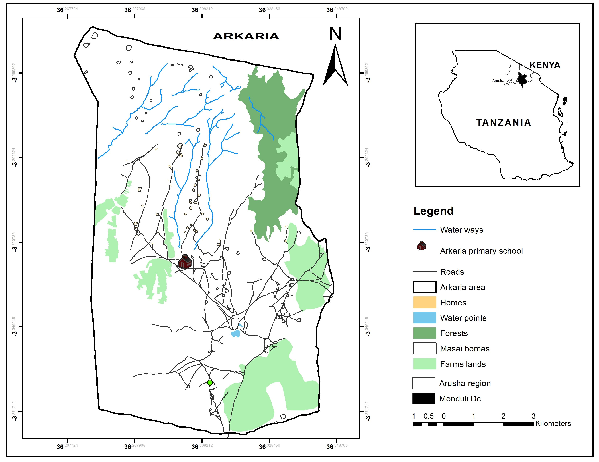

```{r setup, include=FALSE}
knitr::opts_chunk$set(echo = FALSE)
```



**Arkalia Ward** is located in the Arusha Region, specifically within the Arusha District in northern Tanzania. This ward, like many others in the area, is characterized by its agricultural landscape, diverse cultural heritage, and proximity to key tourist attractions. While it might not be as widely known as some other areas in the region, it still holds significance in various ways.

**interesting aspects of Arkalia Ward**:

1.  **Agriculture**: Much of the economy of Arkalia Ward is based on farming. The fertile land in the area supports the cultivation of various crops, including maize, beans, tomatoes, and vegetables. Livestock farming, particularly cattle and goats, is also a prominent aspect of life here. The agricultural activities are vital for the livelihood of the local population.

2.  **Cultural Diversity**: Arusha Region is home to a mix of ethnic groups, including the Maasai, Chaga, Meru, and others. While Arkalia may have a predominant ethnic group, it is likely to see influences from these neighboring groups. The Maasai, for instance, are well-known for their pastoralist culture and traditional dress, and their presence might influence the community dynamics in the ward.

3.  **Tourism Potential**: Although Arkalia Ward itself may not be a well-known tourist destination, its location in Arusha District places it within reach of some of Tanzania’s premier tourist attractions. Arusha is often referred to as the "Safari Capital of Tanzania," with easy access to iconic parks such as Serengeti, Ngorongoro Crater, and Mount Kilimanjaro. The nearby cultural and natural heritage could offer eco-tourism opportunities for visitors who wish to experience the rural Tanzanian lifestyle alongside famous wildlife safaris.

4.  **Mount Meru and Arusha National Park**: Arkalia Ward is situated relatively close to Mount Meru, the second-highest mountain in Tanzania. The mountain offers dramatic landscapes and is part of the larger Arusha National Park, a lesser-known park that offers great hiking, wildlife viewing, and even a chance to explore the Momella Lakes. Mount Meru’s towering presence can be seen from many areas in the Arusha District, including Arkalia.

5.  **Infrastructure and Connectivity**: Arusha itself is well-connected by road, air, and even rail, which provides good access for people in Arkalia Ward to both urban amenities and rural markets. The transport infrastructure is crucial for economic activities, particularly the sale of agricultural produce.

6.  **Climate**: The ward experiences a temperate climate, typical of many areas in the Arusha Region due to its elevation and proximity to Mount Meru. This makes it suitable for a variety of crops and is part of why agriculture is such a key industry in the area.

In summary, **Arkalia Ward** offers a glimpse of rural Tanzania, with a strong agricultural base, diverse cultural influences, and proximity to both nature and tourism hotspots. While it may not yet be a major tourist destination, its location makes it an integral part of the Arusha District’s larger community and economy.
