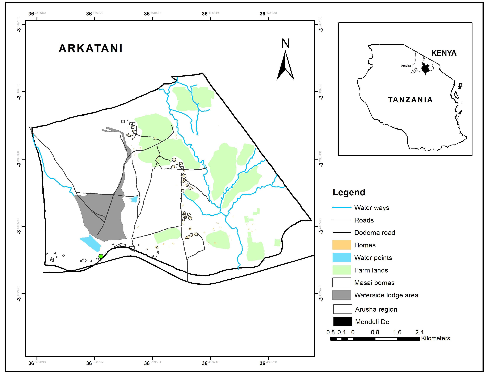

```{r setup, include=FALSE}
knitr::opts_chunk$set(echo = FALSE)
```



**Arkatani Ward** is located in the Arusha Region, in the northern part of Tanzania, and is one of the administrative wards in the region's Arusha District. The area is known for its stunning landscapes, which include rolling hills, farmlands, and proximity to Mount Meru.

**interesting things about Arkatani Ward**

1.  **Agriculture**: The ward's economy is largely based on agriculture, with a focus on the cultivation of crops such as maize, beans, and vegetables. Livestock farming is also common, and the fertile land supports both small-scale farming and larger agricultural ventures.

2.  **Cultural Diversity**: Arusha is home to a mix of ethnic groups, including the Maasai, Chaga, and Meru people, among others. This cultural diversity influences the area's traditions, language, and festivals. The Maasai, in particular, are known for their distinctive lifestyle and traditions, which add a rich cultural layer to the region.

3.  **Proximity to Mount Meru**: Arkatani Ward lies not far from Mount Meru, Tanzania's second-highest peak. This location offers breathtaking views of the mountain and is a gateway to exploring the Mount Meru National Park, which is a popular destination for hiking and wildlife viewing.

4.  **Tourism Potential**: Although not as famous as the nearby Serengeti or Ngorongoro Crater, Arusha District, where Arkatani is located, has growing tourism potential due to its natural beauty and proximity to Arusha National Park. The area's rich cultural heritage and scenic landscapes make it an appealing destination for eco-tourism.

If you're into exploring remote or less-visited parts of Tanzania, Arkatani offers a glimpse into rural Tanzanian life, vibrant culture, and beautiful scenery.
