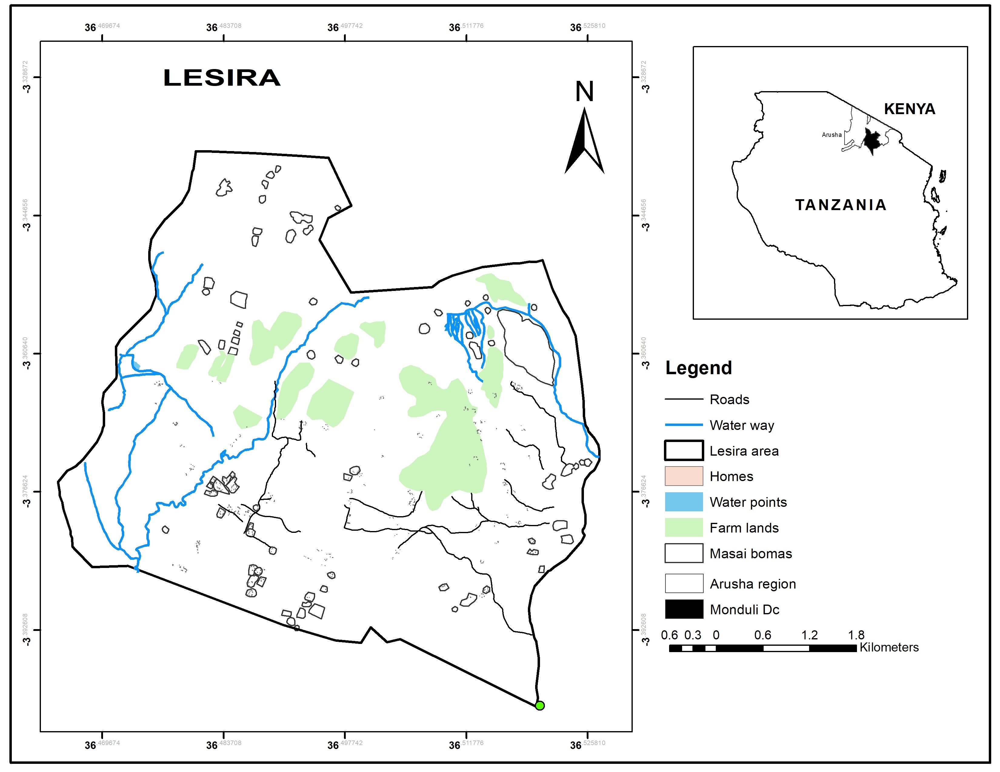

```{r setup, include=FALSE}
knitr::opts_chunk$set(echo = FALSE)
```



**Lesira Ward** is located in the **Arusha Region**, which is in the northern part of Tanzania, an area that is well known for its rich agricultural activities, stunning landscapes, and proximity to some of Tanzania’s most iconic natural attractions.

**interesting aspects of Lesira Ward**:

1.  **Agriculture**: Similar to many areas in the Arusha Region, agriculture is the backbone of the local economy in Lesira Ward. The fertile volcanic soil, thanks to the proximity to Mount Meru, allows for the cultivation of a variety of crops such as maize, beans, tomatoes, vegetables, and coffee. The agricultural practices are mainly small-scale farming, with many households growing crops for subsistence and for local markets. Additionally, livestock farming (especially goats and cattle) is common in the ward.

2.  **Proximity to Mount Meru**: Lesira Ward is situated in the foothills of Mount Meru, Tanzania's second-highest peak. The natural beauty of the area is often enhanced by the breathtaking views of the mountain, which offers great potential for hiking, eco-tourism, and cultural tourism. Mount Meru is a popular destination for climbers, and it is also part of **Arusha National Park**, which attracts visitors with its wildlife and scenic beauty.

3.  **Cultural Heritage**: The region is home to a mix of different ethnic groups, including the Maasai, Chaga, and Meru people, each with their own unique customs, language, and traditions. The Chaga and Meru are typically agriculturalists, while the Maasai are pastoralists. The presence of these communities contributes to a rich cultural heritage, and their traditions are often showcased in local festivals, dances, and handicrafts.

4.  **Ecotourism and Wildlife**: While Lesira itself might not be a major tourist hotspot, its proximity to **Arusha National Park** and **Mount Meru** offers opportunities for eco-tourism. The park is home to a wide variety of wildlife, including giraffes, buffalo, zebras, and various species of monkeys. Visitors can also explore the Momella Lakes and the Ngurdoto Crater. With the rise of sustainable and community-based tourism, there may be opportunities in Lesira to tap into the growing eco-tourism sector.

5.  **Transportation and Connectivity**: Being located in the **Arusha District**, Lesira Ward benefits from relatively good road connectivity to the **city of Arusha**, which serves as the main transport hub for northern Tanzania. Arusha has access to international airports and road links to major tourist destinations such as the Serengeti, Ngorongoro Crater, and the coastal region. This makes Lesira an accessible area for both local traders and tourists.

6.  **Climate**: Lesira Ward experiences a temperate climate, influenced by its high elevation and proximity to Mount Meru. The climate is conducive to farming, and it’s often cooler than many other parts of Tanzania, especially in the dry season. The area enjoys rainfall patterns that support agricultural activities throughout the year.

7.  **Community and Development**: Lesira, like many rural wards, faces challenges related to infrastructure development, education, and access to healthcare. However, there are efforts at the local level to improve living conditions, with various government and NGO programs focusing on rural development. Community-based projects related to agriculture, water access, and education are vital for the local population's well-being and long-term sustainability.

In summary, **Lesira Ward** offers a mix of agriculture, cultural heritage, and proximity to key natural attractions like Mount Meru and Arusha National Park. It provides an interesting perspective on rural life in northern Tanzania, with opportunities for both eco-tourism and agricultural development.
