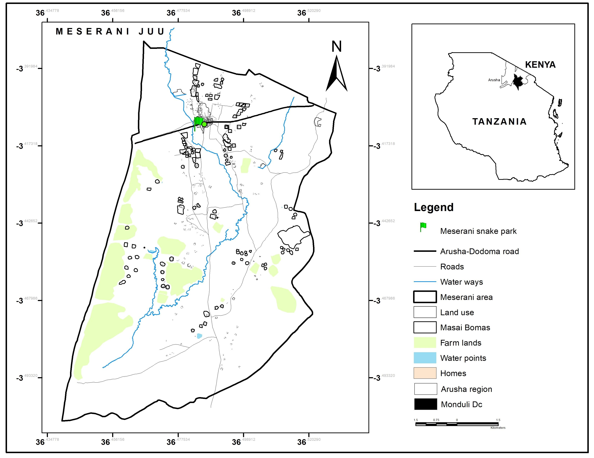

```{r setup, include=FALSE}
knitr::opts_chunk$set(echo = FALSE)
```



**Meserani Juu Ward** is located in the **Arusha Region** of northern Tanzania. This area is part of the larger **Arusha District** and is situated in a region known for its agriculture, wildlife, and proximity to key tourist destinations such as the Serengeti and Ngorongoro Crater. Meserani Juu, in particular, offers a more rural setting, with a unique blend of cultural traditions, landscapes, and local industries.

Here are some interesting aspects of **Meserani Juu Ward**:

1.  **Agriculture**: Like many parts of the Arusha Region, Meserani Juu relies heavily on agriculture for its economy. The fertile soils in the area support the cultivation of various crops, including maize, beans, tomatoes, and vegetables. Livestock farming, particularly cattle, goats, and sheep, is also an important livelihood for many families in the ward. The agriculture in the region is typically small-scale, though there are also larger farming enterprises focused on the production of cash crops.

2.  **Proximity to Wildlife and National Parks**: Meserani Juu Ward is located relatively close to **Arusha National Park**, which is renowned for its wildlife, including giraffes, buffalo, zebras, and various species of monkeys. The area offers a more relaxed, off-the-beaten-path experience compared to more famous national parks like the Serengeti and Ngorongoro Crater. The park’s landscapes also include volcanic craters and the Momella Lakes, making the region a potential attraction for eco-tourism and wildlife enthusiasts.

3.  **Maasai Community**: The Maasai people, who are traditionally pastoralists, are a significant presence in Meserani Juu and the surrounding areas. The Maasai are known for their distinct culture, language, and customs, including their unique clothing (such as the brightly colored shuka) and their traditional dances and rituals. In recent years, the Maasai have also become involved in tourism, with many offering cultural experiences and guided tours to share their way of life with visitors.

4.  **Cultural Heritage and Tourism**: Meserani Juu Ward offers a mix of both cultural and natural experiences. The Maasai cultural practices, including traditional ceremonies and customs, are an attraction for tourists. Visitors to the area can participate in Maasai-led tours to learn about their history, traditional homes (enkangs), and the significance of livestock. This helps contribute to the local economy and provides a sustainable form of tourism that benefits the community.

5.  **Transport and Accessibility**: Meserani Juu is relatively accessible from the **city of Arusha**, which is a major transport hub for northern Tanzania. The region is well-connected by road, with routes leading to major tourist destinations such as the Serengeti, Ngorongoro Crater, and Mount Kilimanjaro. As a result, Meserani Juu can benefit from its proximity to these key tourist destinations, though it remains a quieter and less crowded area, offering more of an authentic rural experience.

6.  **Climate**: The climate in Meserani Juu is influenced by its elevation and proximity to Mount Meru. The area enjoys a temperate climate, which is conducive to farming. The rainy season, which typically occurs between March and May, helps support the agricultural activities in the area. However, like much of northern Tanzania, the region can experience drought periods, which pose challenges to farming and livestock.

7.  **Challenges and Development**: While Meserani Juu Ward benefits from its location near Arusha National Park and the presence of the Maasai community, it also faces challenges typical of rural Tanzania, including access to healthcare, education, and infrastructure development. The ward has potential for further growth, particularly in tourism, but ongoing investments in roads, schools, and healthcare services are needed to improve the overall quality of life for its residents.

In summary, **Meserani Juu Ward** is a rural area that offers a mix of agricultural activity, cultural heritage, and proximity to wildlife and national parks. It is part of a region known for its natural beauty and cultural diversity, with the Maasai community playing a central role in the ward’s cultural and economic life. While it may not be a major tourist hotspot, the ward has great potential for eco-tourism and cultural tourism, making it an intriguing area for those interested in experiencing authentic Tanzanian rural life.
