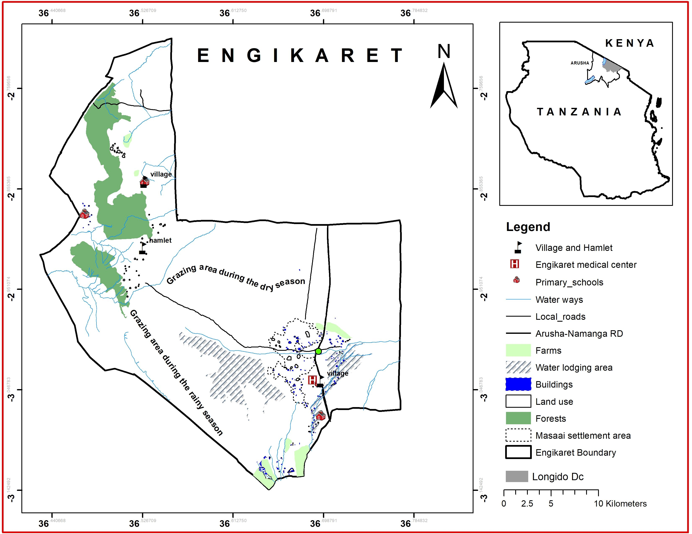

```{r setup, include=FALSE}

```

knitr::opts_chunk\$set(echo = FALSE)

**Engikaret Ward** is located in the **Arusha Region**, within the **Arusha District** in northern Tanzania. This area is situated in a region rich in agricultural activities, wildlife, and cultural heritage. Engikaret, like many wards in the region, is influenced by the nearby natural attractions, including **Mount Meru** and **Arusha National Park**, as well as the presence of various ethnic groups, including the **Maasai**.

Here are some key aspects of **Engikaret Ward**:

1.  **Agriculture**: Agriculture plays a central role in the local economy of Engikaret Ward. The fertile volcanic soil, particularly influenced by the proximity to Mount Meru, supports the cultivation of crops like maize, beans, vegetables, and fruits. Livestock farming is also an essential part of the ward’s economy, with many residents raising cattle, goats, and sheep. Agriculture in the area is typically small-scale, though larger farming operations also exist. The agricultural activities are important for both subsistence and local market sales.

2.  **Cultural Heritage**: Engikaret Ward is home to a mix of different ethnic groups, with a significant presence of the **Maasai** community. The Maasai people are well known for their pastoralist lifestyle and their vibrant culture, including their distinctive clothing, language, and ceremonies. The Maasai’s deep connection to the land and livestock plays a significant role in shaping the ward's cultural identity. The Maasai are often involved in eco-tourism ventures, offering visitors cultural experiences that include traditional dances, rituals, and visits to their homesteads (enkangs).

3.  **Proximity to Arusha National Park**: Engikaret Ward is situated near **Arusha National Park**, which is famous for its scenic beauty and wildlife. The park is home to a variety of species, including giraffes, zebras, buffalo, and different types of monkeys. The park also features the beautiful **Momella Lakes** and **Ngurdoto Crater**, which attract visitors for hiking, wildlife viewing, and bird watching. The proximity of Engikaret to the park means that the area could benefit from tourism opportunities, both in terms of eco-tourism and cultural tourism involving the Maasai community.

4.  **Maasai Tourism**: As with other parts of the Arusha Region, the Maasai people in Engikaret are increasingly involved in tourism. Many Maasai communities offer visitors a chance to experience their way of life by participating in activities such as visiting traditional Maasai villages, learning about the Maasai’s nomadic lifestyle, and observing cultural performances. This type of tourism is valuable as it allows for the preservation of Maasai traditions while providing economic benefits to the community.

5.  **Climate and Livelihood**: The climate in Engikaret is influenced by the highland areas of the Arusha District. The temperate climate, combined with fertile soils, supports farming activities, making the region favorable for agricultural production. The area experiences two rainy seasons (the long rains from March to May and the short rains from November to December), which support the growth of crops. However, like much of rural Tanzania, the area may also experience dry spells, which can affect agriculture and livestock.

6.  **Infrastructure and Development**: While Engikaret Ward is relatively rural, it benefits from being part of the **Arusha District**, which is an important hub for both commerce and tourism in northern Tanzania. The transport infrastructure, particularly road networks, provides access to the city of Arusha and other key destinations in the region. However, the ward still faces challenges associated with rural development, including access to education, healthcare, and reliable infrastructure.

7.  **Tourism Potential**: The ward’s proximity to both **Arusha National Park** and the Maasai culture positions it well for tourism development. **Eco-tourism** and **cultural tourism** are key sectors that could be developed further to benefit the local population. Visitors to the area can experience a combination of natural beauty, wildlife, and cultural heritage, which makes it an attractive option for those seeking a more authentic experience compared to the more heavily visited national parks in Tanzania.

In summary, **Engikaret Ward** is an area with a strong agricultural base, deeply rooted Maasai cultural traditions, and proximity to Arusha National Park. It offers opportunities for eco-tourism and cultural tourism, with potential for development in these areas to provide economic benefits to the local population. The ward’s location near Mount Meru and its agricultural activity makes it an important part of the broader Arusha District.
