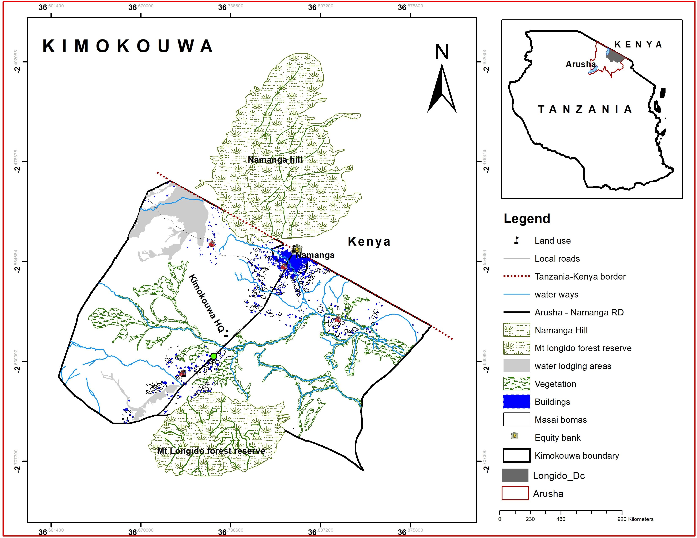

```{r setup, include=FALSE}
knitr::opts_chunk$set(echo = FALSE)
```



**Kimokouwa Ward** is located in the **Arusha Region** of northern Tanzania, within the larger **Arusha District**. The region is known for its rich culture, agricultural activities, and natural beauty, especially due to its proximity to major tourist destinations like **Mount Meru** and **Arusha National Park**.

Here are some interesting aspects of **Kimokouwa Ward**:

1.  **Agriculture**: Agriculture is a major contributor to the local economy in **Kimokouwa Ward**. The fertile volcanic soil in the area supports the cultivation of various crops such as maize, beans, tomatoes, vegetables, and fruits. Coffee farming may also be a significant activity, especially in the higher altitudes where the climate is suitable for coffee cultivation. Additionally, livestock farming, including cattle, goats, and sheep, is common in the ward, with many families relying on it for both sustenance and income.

2.  **Proximity to Mount Meru and Arusha National Park**: **Kimokouwa Ward** is located relatively close to **Mount Meru**, Tanzania's second-highest peak. The mountain is a popular hiking destination and provides dramatic landscapes, offering opportunities for eco-tourism. **Arusha National Park** is also nearby, attracting tourists with its wildlife, including giraffes, zebras, and monkeys, as well as the scenic **Momella Lakes** and **Ngurdoto Crater**. The ward’s proximity to these natural attractions presents opportunities for tourism, especially eco-tourism and hiking-related activities.

3.  **Maasai Community**: Similar to other parts of the **Arusha Region**, the **Maasai** people have a significant presence in Kimokouwa Ward. The Maasai are a semi-nomadic pastoralist ethnic group known for their distinct culture, colorful clothing (especially the shuka), and traditional practices. The Maasai’s deep connection to the land and livestock influences much of the local lifestyle in Kimokouwa. Many Maasai families are involved in the livestock trade, and their traditional way of life continues to be a point of cultural pride.

4.  **Cultural Tourism**: The Maasai community in Kimokouwa is involved in cultural tourism, where they offer visitors an opportunity to learn about their customs, traditions, and way of life. Visitors can tour Maasai villages (enkangs), watch traditional dances, and learn about the significance of cattle and livestock to the community. Cultural tourism in Kimokouwa not only helps preserve the Maasai’s heritage but also provides economic benefits to the local population.

5.  **Climate and Agriculture**: The climate in Kimokouwa Ward is influenced by its elevation and proximity to Mount Meru. The area experiences a temperate climate, which is conducive to agricultural activities such as crop cultivation and livestock farming. The rainfall pattern, with long rains typically from March to May and short rains from November to December, helps support farming. However, the ward, like other rural areas in Tanzania, may face challenges such as drought and water scarcity, which can affect agricultural productivity.

6.  **Infrastructure and Development**: Kimokouwa is relatively rural but benefits from its proximity to the city of **Arusha**, which is an important commercial and transport hub in northern Tanzania. Arusha is well-connected by road and air to other major cities and tourist destinations, which can facilitate trade and tourism in Kimokouwa. However, infrastructure development in Kimokouwa itself, such as roads, healthcare, and education, may still face challenges common to rural areas.

7.  **Tourism Potential**: The combination of natural beauty, proximity to Mount Meru, Arusha National Park, and Maasai culture makes **Kimokouwa Ward** a prime candidate for further tourism development. **Eco-tourism** and **cultural tourism** can play an important role in the local economy, providing income for the community while preserving the environment and cultural heritage.

In summary, **Kimokouwa Ward** is an area rich in agricultural activities, cultural heritage, and natural beauty. Its proximity to **Mount Meru** and **Arusha National Park** makes it an attractive location for eco-tourism, while the presence of the Maasai community provides a unique cultural experience for visitors. With further development in tourism, agriculture, and infrastructure, Kimokouwa has the potential to thrive both economically and culturally.
